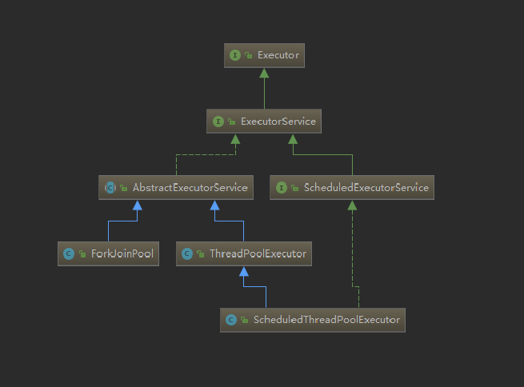
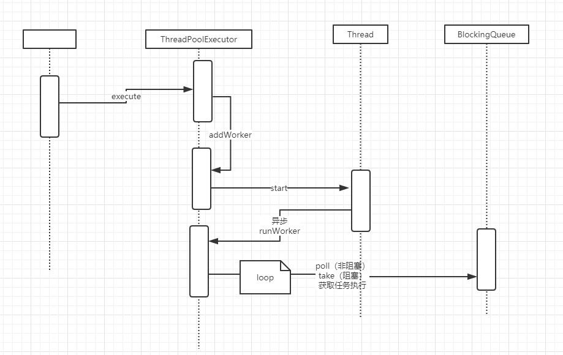

### ThreadPoolExecutor解析

### 类图如下



对ThreadPoolExecutor的解析如下：

### 数据结构

HashSet存放work，work中包装了thread。HashSet的大小代表了线程池的大小。


### 函数调用入口

创建线程后调用execute，代码如下

```java
public void execute(Runnable command) {
    if (command == null)
        throw new NullPointerException();
    
    int c = ctl.get();
    if (workerCountOf(c) < corePoolSize) {
        if (addWorker(command, true))
            return;
        c = ctl.get();
    }
    if (isRunning(c) && workQueue.offer(command)) {
        int recheck = ctl.get();
        if (! isRunning(recheck) && remove(command))
            reject(command);
        else if (workerCountOf(recheck) == 0)
            addWorker(null, false);
    }
    else if (!addWorker(command, false))
        reject(command);
}
```

此类中有三部分：

1.线程数量小于corePoolSize，则往线程池中增加线程。即调用addWorker，
 每次调用execute，即使有空闲的线程，只要满足条件（线程数量小于corePoolSize）都会创建线程。
 在addWorker内部还会再次验证runState和workerCount。

2.如果达到上限，且队列还有空间，则将任务放入队列。
这里的offer是非阻塞的。

3.队列也满的情况下，创建线程。如果超过maximumPoolSize,则拒绝任务。

### 相关的调用链:

execute -> addWorker -> new Worker ---> thread.start





* addWorker代码解析

```java
private boolean addWorker(Runnable firstTask, boolean core) {
    retry:
    for (;;) {
        int c = ctl.get();
        int rs = runStateOf(c);

        // Check if queue empty only if necessary.
        if (rs >= SHUTDOWN &&
            ! (rs == SHUTDOWN &&
               firstTask == null &&
               ! workQueue.isEmpty()))
            return false;

        for (;;) {
            int wc = workerCountOf(c);
            if (wc >= CAPACITY ||
                wc >= (core ? corePoolSize : maximumPoolSize))
                return false;
            if (compareAndIncrementWorkerCount(c))
                break retry;
            c = ctl.get();  // Re-read ctl
            if (runStateOf(c) != rs)
                continue retry;
            // else CAS failed due to workerCount change; retry inner loop
        }
    }

    boolean workerStarted = false;
    boolean workerAdded = false;
    Worker w = null;
    try {
        w = new Worker(firstTask);
        final Thread t = w.thread;
        if (t != null) {
            final ReentrantLock mainLock = this.mainLock;
            mainLock.lock();
            try {
                // Recheck while holding lock.
                // Back out on ThreadFactory failure or if
                // shut down before lock acquired.
                int rs = runStateOf(ctl.get());

                if (rs < SHUTDOWN ||
                    (rs == SHUTDOWN && firstTask == null)) {
                    if (t.isAlive()) // precheck that t is startable
                        throw new IllegalThreadStateException();
                    workers.add(w);
                    int s = workers.size();
                    if (s > largestPoolSize)
                        largestPoolSize = s;
                    workerAdded = true;
                }
            } finally {
                mainLock.unlock();
            }
            if (workerAdded) {
                t.start();
                workerStarted = true;
            }
        }
    } finally {
        if (! workerStarted)
            addWorkerFailed(w);
    }
    return workerStarted;
}
```

其中的核心代码有如下

compareAndIncrementWorkerCount(c) //调整线程的数量

workers.add(w); //将线程加入到HashSet中。

t.start(); //启动线程。

### 线程异步启动

* runWorker的代码解析

```java
final void runWorker(Worker w) {
    Thread wt = Thread.currentThread();
    Runnable task = w.firstTask;
    w.firstTask = null;
    w.unlock(); // allow interrupts
    boolean completedAbruptly = true;
    try {
        while (task != null || (task = getTask()) != null) {
            w.lock();
            // If pool is stopping, ensure thread is interrupted;
            // if not, ensure thread is not interrupted.  This
            // requires a recheck in second case to deal with
            // shutdownNow race while clearing interrupt
            if ((runStateAtLeast(ctl.get(), STOP) ||
                 (Thread.interrupted() &&
                  runStateAtLeast(ctl.get(), STOP))) &&
                !wt.isInterrupted())
                wt.interrupt();
            try {
                beforeExecute(wt, task);
                Throwable thrown = null;
                try {
                    task.run();
                } catch (RuntimeException x) {
                    thrown = x; throw x;
                } catch (Error x) {
                    thrown = x; throw x;
                } catch (Throwable x) {
                    thrown = x; throw new Error(x);
                } finally {
                    afterExecute(task, thrown);
                }
            } finally {
                task = null;
                w.completedTasks++;
                w.unlock();
            }
        }
        completedAbruptly = false;
    } finally {
        processWorkerExit(w, completedAbruptly);
    }
}
```


此处是一个while死循环，当第一次执行时，如果task不为空，则执行task任务。
第二次循环时，task为空，则调用getTask().
getTask会阻塞。阻塞的时间根据keepAliveTime的不同，如果为非阻塞，则没有task时循环结束。如果为阻塞，则阻塞在此处。
如果返回为空，则循环结束。则线程也结束退出。

* 阻塞与否的判断条件：

如果线程池中线程的数量大于corePoolSize，则是非阻塞的，该线程退出。

如果小于corePoolSize，则线程阻塞。等待下一个任务的达到。