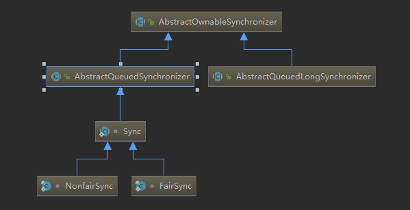
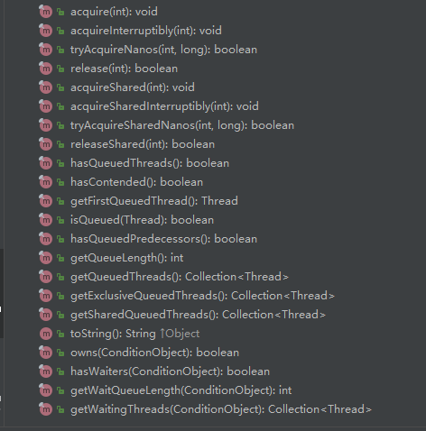
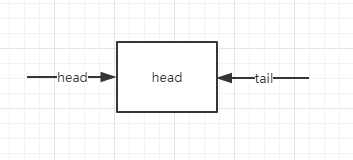
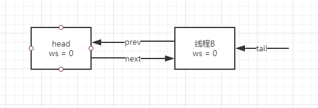
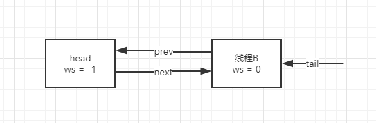

# Table of Contents
* [锁的类图如下](#锁的类图如下)
* [重要的方法](#重要的方法)
* [总结](#总结)
* [加锁示例](#加锁示例)

### 锁的类图如下



采用了template模式，主要的工作在AQS（AbstractQueuedSynchronizer）这个类中完成。

下面是AQS类中的方法：




acquire用作获得锁，release用作释放锁。子类继承AQS后，只需要根据实际场景实现获取锁的流程就可以了，即维护状态变量。每次获得锁将变量加1，释放锁减1。

### 重要的方法

acquire(int): void

tryAcquire

acquireQueued

addWaiter

下面分别解析这几个重要的方法

```java
public final void acquire(int arg) {
    if (!tryAcquire(arg) &&
        acquireQueued(addWaiter(Node.EXCLUSIVE), arg))
        selfInterrupt();
}
```

在该方法中有下面几步：

1.调用tryacqire，获取锁。如果成功，则直接返回。

2.如果失败，则调用acquireQueued，尝试将该进程放入队列，并阻塞该线程

tryAcquire需要在子类中实现。如ReentrantLock，在该类中，引用sync，而从类图中可以看到sync继承自AQS。所以ReentrantLock中只需要实现tryAcquire，即可具有所有锁的逻辑：加锁、释放锁等。


------


```java
private Node addWaiter(Node mode) {
    Node node = new Node(Thread.currentThread(), mode);
    // Try the fast path of enq; backup to full enq on failure
    Node pred = tail;
    if (pred != null) {
        node.prev = pred;
        if (compareAndSetTail(pred, node)) {
            pred.next = node;
            return node;
        }
    }
    enq(node);
    return node;
}
```

首先将该线程作为参数，创建一个node对象。

然后，使用CAS将node对象放到队尾。如果放置成功，则直接返回。

特殊情况，如果现在队列刚创建，没有队尾，则进入enq方法中。

如果CAS失败，也会进入到enq方法中。

------


```Java
private Node enq(final Node node) {
    for (;;) {
        Node t = tail;
        if (t == null) { // Must initialize
            if (compareAndSetHead(new Node()))
                tail = head;
        } else {
            node.prev = t;
            if (compareAndSetTail(t, node)) {
                t.next = node;
                return t;
            }
        }
    }
}
```
enq中有一个自旋，直到CAS成功为止。

有两种情况会进入到该方法：

1.队列此时是空的，没有node和tail

2.addWaiter的CAS失败。

如果是情况1，则进入if语句，创建node节点，并将head和tail同时指向同一个node

接着进行第二次for循环，此时进入else代码块中，将参数node放入队列尾部。并返回。

如果是情况2，则直接进入到else代码块中进行CAS操作，直到成功，然后返回。

执行到这里，获取锁的线程已经被放入到队列中。接下来就是要阻塞线程。

------


```java
final boolean acquireQueued(final Node node, int arg) {
    boolean failed = true;
    try {
        boolean interrupted = false;
        for (;;) {
            final Node p = node.predecessor();
            if (p == head && tryAcquire(arg)) {
                setHead(node);
                p.next = null; // help GC
                failed = false;
                return interrupted;
            }
            if (shouldParkAfterFailedAcquire(p, node) &&
                parkAndCheckInterrupt())
                interrupted = true;
        }
    } finally {
        if (failed)
            cancelAcquire(node);
    }
}
```

该方法的参数是addWaiter返回的参数：node.

获取node的前置，如果是head（在这里head是一个哨兵位，不代表线程），则node中的线程可以直接尝试获取锁。如果成功，则将node从队列中删除，并返回。

如果node的前置不是head，则直接阻塞当前线程。

考虑一个场景，假设只有两个线程，线程1这时在执行阻塞中，线程2即将释放锁。线程1如果将ws设置为 Node.SIGNAL后，还未阻塞（park）当前线程1，另外一个线程2释放锁，并发现队列中线程1的ws为Node.SIGNAL，则调用线程1的unpark，然后线程1执行park，会发生线程1永远阻塞吗？答案是不会。因为park、unpark没有先后顺序，只要成对出现即可。


### 总结

以上就是AQS获取锁的代码。整体的流程是，如果获取锁不成功，则将当前线程放入到队列中，并且阻塞当前线程。

### 加锁示例

现在假设有2个线程获取锁。

线程A、线程B

线程A先执行，tryAcquire直接返回true，获取锁成功。

线程B后执行，tryAcquire失败，则进入addWaiter方法，这时tail == null，则直接执行enq方法。

在enq中第一步，创建一个node，并将head、tail指向该node。



然后将线程B的node放入队尾，如下图



此时队列已经构建完成。下一步准备将线程B阻塞。


在阻塞前需要修waitStatus，修改为Node.SIGNAL（-1），表示该线程需要唤醒（unpark）。



这时线程B可以安全的阻塞。

------

释放锁的过程如下

```java
if (h != null && h.waitStatus != 0)
    unparkSuccessor(h);
```

这里h代表head，被unpark的线程是h->next，即线程B。此时B被唤醒。

线程B继续执行acquireQueued的自旋，成功获取锁。至此结束。